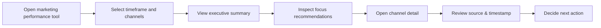

# Task 1: Product Scoping

## Context
The company builds internal tools for marketing teams to understand channel performance. Analysts currently manually dig through existing tools, producing inconsistent, slow, and person-dependent answers. The solution must fit around existing tools and workflows rather than replace them.

## Primary user
- **Primary user:** internal marketing analyst
- **Secondary user:** marketing operations manager / campaign owner

### Justification
Internal analysts are the best starting point for V1 because they:
- already own the current pain
- need a repeatable, trusted summary quickly
- can validate output against existing tools
- are the users most likely to accept a tool that augments rather than replaces workflow

Client-facing views should be intentionally out of V1. The first release should prove value internally, then expose a polished view for clients once trust and data alignment are established.

## What a successful interaction looks like
1. Analyst opens the tool and sees a concise answer to: “How are we performing across channels right now?”
2. The tool highlights the strongest and weakest channels, surface anomalies, and recommends where to focus.
3. The analyst can drill into one or two channels to confirm which campaigns are moving metrics.
4. The analyst feels confident enough to answer a stakeholder query or prioritize a follow-up review.

## Data sources required and reliability assumptions
### Required data sources
- Channel performance metrics (ad spend, impressions, clicks, conversions, ROI) from existing marketing platforms or a centralized attribution layer.
- Campaign metadata: channel, campaign name, objective, start/end dates.
- Historical baseline or target performance for trend comparison.
- Current spend and conversion status from the existing analytics/BI tools.

### Reliability assumptions
- Data is available via the existing systems within the same business day.
- Channel definitions are stable and mapped consistently across sources.
- Spend and conversion values are the source of truth from the existing tools; the new tool does not recalculate attribution.
- If a channel metric is missing, the interface surfaces the gap rather than invents a value.

## V1 Scope
### What's IN
- A single internal dashboard for marketing analysts.
- A summary view of current performance across channels.
- A focus recommendation section identifying the top 1–2 channels to investigate.
- Drill-down to channel-level performance metrics and a brief explanation of why that channel is highlighted.
- Transparent source labels and a timestamp for the freshest data.
- A basic anomaly badge for large deviations against the recent baseline.

### What's deliberately OUT
- Client-facing reporting and brand-safe visual styling.
- Full campaign-level budgeting or planning workflows.
- Deep attribution modeling or automated budget reallocation.
- Integrations that rewrite or change existing marketing tools.
- AI-generated narrative summaries beyond one or two templated sentences.

### Reasoning
A tight V1 needs to answer one core question with minimal risk: current channel performance and where to focus. By keeping the scope internal and avoiding attribution/modeling, we reduce engineering complexity and build trust quickly.

## What makes users trust the output
- **Source transparency:** every metric shows where it came from and when it was last refreshed.
- **Consistent definitions:** the tool only surfaces metrics that match existing channel definitions.
- **Error visibility:** missing or stale data is flagged clearly, not hidden.
- **Predictable recommendations:** focus suggestions are based on simple rules (e.g. underperforming high-spend channels, channels with large downward trend and enough data volume).
- **Audit trail:** analysts can click through to the underlying channel-level data.

## User journey


## Wireframe of the main interface

```
+--------------------------------------------------------------------------------+
| [Header] Marketing Performance Today          [Date selector] [Channel filter] |
+--------------------------------------------------------------------------------+
| Summary card: Performance score  |  Focus signal  |  Top channel  |  Data freshness |
+--------------------------------------------------------------------------------+
| Channel table:                                                                  |
|   Channel | Spend | Conversions | CPA | Trend | Focus status | Source            |
|   Email   | 23k   |   450      | 51  |  +5%  | Low focus     | CRM tool          |
|   Paid Social | 18k | 320      | 56  |  -12% | Investigate   | Ad platform API   |
|   Search   | 15k   | 410       | 37  |  +1%  | Monitor       | Search console    |
+--------------------------------------------------------------------------------+
| Drill-down panel:                                                              |
|   - Why this channel? Underperforming relative to baseline and spend.          |
|   - Related campaigns: campaign names, spend, conversions, last updated.       |
|   - Suggested first check: attribution window, audience overlap, creative test.|
+--------------------------------------------------------------------------------+
```

## README-style decisions note
### What I chose and why
- Chose an internal analyst-first product because it delivers the biggest immediate value and reduces the risk of prematurely exposing imperfect data.
- Scoped the tool to summary + channel drill-down, because the team must not change existing tools or workflows.
- Left out heavy modeling and client dashboards to keep delivery fast and defensible.
- Emphasized trust through transparency, data-source labels, and visible staleness.

### What I would revisit with more time
- Add a lightweight audit trail that shows the exact channel data source and query used for each metric.
- Build a small "data health" panel showing which connectors are stale or missing.
- Validate the recommendation rules with actual stakeholder interviews.
- Add a second persona path for campaign owners versus analysts.
- Upgrade the wireframe into a clickable prototype with actual data.
